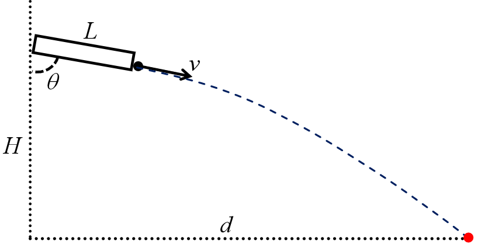

# Calculation of Gimbal Rotation

## Calculation of Yaw

The change in yaw is relatively easy to calculate. Since the center of the camera and the gimbal are on the same vertical plane, we only need to move the centor of the detection box to the centor of the image. Assume that the width of the image is $w$ and the abscissa of the center of the detection box is $x$, then the detection box needs to move $w-x$ pixels. In order to pervent the gimbal from rotating too much, directly set the rotation angle to $$\Delta y = 0.05\times\tanh\left(w - x\right)$$

## Calculation of Pitch



The length of the robot's barrel is $L$, the horizontal and vertical distance from the launch point to the target point are $d$ and $H$ respectively, the velocity of the bullet when it is shot from the muzzle is $v$, and the acceleration due to gravity is $g$. In order to calculate the angle $\theta$ between the barrel and the vertical direction, assuming that the time it takes for the bullet to reach the target point after leaving the barrel is $\tau$. Neglecting air resistance, we can get $$d - L\cos\theta = v\tau\cos\theta \\ H - L\sin\theta = v\tau\sin\theta + \dfrac{1}{2}g\tau^2$$ By combining the two equations and eliminating $\tau$, we get $$\left(gL^2 - 2v^2H\right)\cos^2\theta + 2v^2d\sin\theta\cos\theta - 2gdL\cos\theta + gd^2 = 0$$ Let $t = \tan\dfrac{\theta}{2}$, then we have $$\sin\theta = \dfrac{2t}{1+t^2} \\ \cos\theta = \dfrac{1-t^2}{1+t^2}$$ Substituting these two equations into the previous eqution, we can get a fourth degree equation about $t$ $$\left(gL^2 - 2v^2H + 2gdL + gd^2\right)t^4 - 4v^2dt^3 + \left(4v^2H - 2gL^2 + 2gd^2\right)t^2 + 4v^2dt + \left(gL^2 - 2v^2H - 2gdL + gd^2\right) = 0$$ The vertical distance from the launch point to the center of the armor plate is $H \approx 0.25\mathrm m$, the barrel length is $L \approx 0.13\mathrm m$, the velocity of the bullet when leaving the barrel is $v \approx 25\mathrm{m/s}$, the gravity acceleration $g$ can be measured locally, the horizontal distance from the launch point to the center of the armor plate $d$ can be measured by the object detection model and the depth camera. So, just call the function in NumPy that solves polynomial equations to get $t$.

```
numpy.rots(list)
```

After getting $t$, according to the relationship between $t$ and $\theta$, we can get $$\theta = 2\arctan t$$ In order to prevent the difference $p$ between $\theta$ and the current angle of the gimbal from being too large, causing the gimbal to rotate violently, we need to limit the rotation angle of the gimbal to $$\Delta p = \mathrm{sgn}\left(p\right)\min\lbrace|p|, 0.05\rbrace$$
