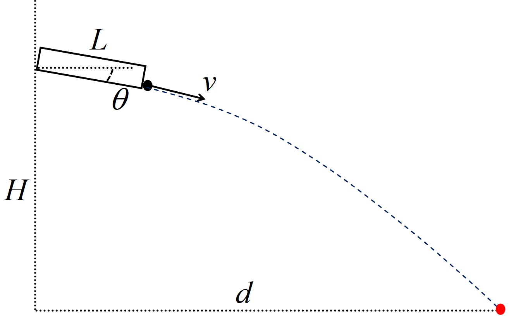

# 云台转动角度解算

## Yaw 角的解算

云台 yaw 角的变化量解算相对容易，由于相机中心与云台在同一竖直平面上，所以只需让检测框的中心移动至图像中心即可。设图像宽度为 $w$，检测框中心横坐标为 $x$，则需让其移动 $w - x$ 个像素，同时为了防止云台移动幅度过大，所以直接将云台的转动角度设为 $$\Delta y = 0.05\times\tanh\left(2 - \dfrac{4x}{w}\right)$$

## Pitch 角的解算



机器人的枪管长度为 $L$，发射点到目标点的水平距离为 $d$，竖直距离为 $H$，子弹从枪口射出时的速度大小为 $v$，重力加速度大小为 $g$，为了解算枪管与水平方向的夹角 $\theta$，设子弹在离开枪管后经过时间 $\tau$ 到达目标点，忽略空气阻力，在水平方向上有 $$d - L\cos\theta = v\tau\cos\theta$$ 在竖直方向上有 $$H - L\sin\theta = v\tau\sin\theta + \dfrac{1}{2}g\tau^2$$ 联立以上两式可消去 $\tau$，得到 $$\left(gL^2 - 2v^2H\right)\cos^2\theta + 2v^2d\sin\theta\cos\theta - 2gdL\cos\theta + gd^2 = 0$$ 令 $t = \tan\dfrac{\theta}{2}$，则有 $$\sin\theta = \dfrac{2t}{1+t^2}, \cos\theta = \dfrac{1-t^2}{1+t^2}$$ 代入上式，整理得到关于 $t$ 的一元四次方程 $$\left(gL^2 - 2v^2H + 2gdL + gd^2\right)t^4 - 4v^2dt^3 + \left(4v^2H - 2gL^2 + 2gd^2\right)t^2 + 4v^2dt + \left(gL^2 - 2v^2H - 2gdL + gd^2\right) = 0$$ 其中，发射点到装甲板中心的竖直距离 $H \approx 0.2\mathrm m$，枪管长度 $L \approx 0.12\mathrm m$，子弹离开枪管时的速度大小 $v \approx 20\mathrm{m/s}$，重力加速度大小 $g$ 可在当地测得，发射点到装甲板中心的水平距离 $d$ 可由目标检测模型配合深度相机测得，然后调用 NumPy 求解多项式方程的函数即可求得 $t$。

```
numpy.rots(list)
```

求得 $t$ 后，根据 $t$ 和 $\theta$ 的关系即可得到 $$\theta = 2\arctan t$$ 为了防止 $\theta$ 与云台当前角度的差值 $p$ 过大造成云台剧烈转动，最后限制云台 pitch 角的变化角度为 $$\Delta p = \mathrm{sgn}\left(p\right)\min\lbrace|p|, 0.05\rbrace$$
